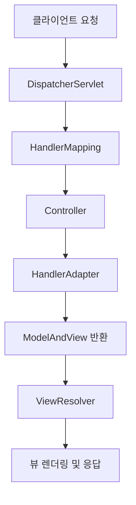

# 스프링 DispatcherServlet 동작 원리

## DispatcherServlet이란?
DispatcherServlet은 Spring MVC에서 Front Controller 패턴을 구현한 서블릿(servlet)이다. 모든 HTTP 요청을 받아 적절한 컨트롤러로 분배(dispatch)하고, 결과를 뷰로 전달하는 핵심 역할을 맡는다.

## 동작 과정 요약

### Step by Step

1. **클라이언트 요청**
    - 사용자가 브라우저 등에서 Spring 애플리케이션의 특정 URL로 HTTP 요청을 보낸다.

2. **DispatcherServlet 수신**
    - Spring에 등록된 DispatcherServlet이 모든 요청을 받는다. (web.xml 또는 어노테이션 기반 설정)

3. **HandlerMapping을 통해 컨트롤러 결정**
    - DispatcherServlet은 HandlerMapping에게 URL에 맞는 컨트롤러(Handler)를 조회한다.

4. **Controller 호출**
    - 알맞은 컨트롤러(Handler)가 선택되어 비즈니스 로직을 수행한다.  
      
5. **HandlerAdapter를 통한 실행**
    - 컨트롤러 실행 방식을 추상화한 HandlerAdapter가 실제 컨트롤러 메서드 호출을 담당한다.

6. **ModelAndView 반환**
    - 컨트롤러는 Model과 View 정보를 합친 ModelAndView 객체를 반환한다.

7. **ViewResolver로 뷰 결정**
    - 뷰 이름을 ViewResolver가 해석해 실제 뷰(jsp, thymeleaf 등)를 찾는다.

8. **뷰 렌더링 및 응답 반환**
    - DispatcherServlet이 뷰를 렌더링하여 최종 결과를 클라이언트에 반환한다.

## 핵심 포인트 정리

- DispatcherServlet = Spring MVC의 Front Controller
- 요청-분기-실행-응답의 중심축
- 다양한 전략 인터페이스(HandlerMapping, HandlerAdapter, ViewResolver 등)와 협력하여 유연한 구조 제공

---

## 참고자료  
- [Spring 공식 문서 - DispatcherServlet](https://docs.spring.io/spring-framework/docs/current/reference/html/web.html#mvc-servlet)
- [Baeldung - DispatcherServlet Explained](https://www.baeldung.com/spring-dispatcherservlet)
- [김영한, 스프링 MVC 1편 강의 자료](https://www.inflearn.com/course/스프링-mvc-1)
