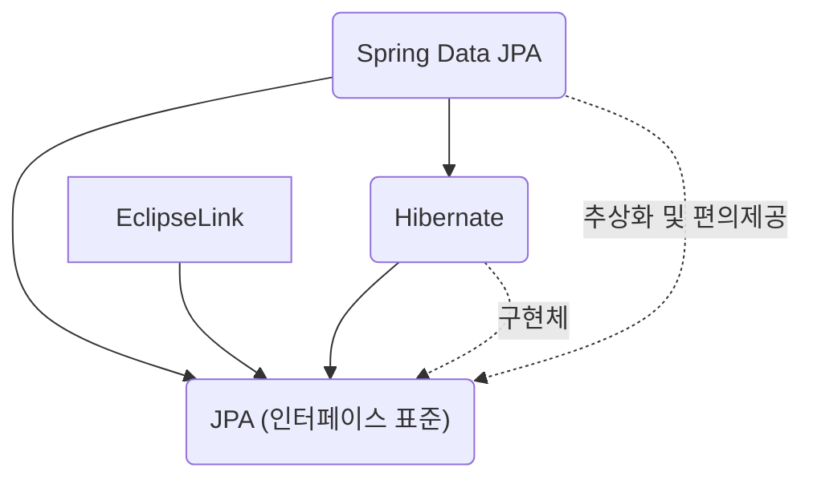

## JPA, Hibernate, Spring Data JPA 의 차이가 무엇인가요?

### 1. JPA (Java Persistence API)
`JPA`는 자바 애플리케이션에서 관계형 데이터베이스를 사용하는 방식을 정의한 **표준 인터페이스**입니다. 단순한 명세이기 때문에 인터페이스와 규약만 정의하며, 실제 구현체는 제공하지 않습니다.
즉, JPA를 쓰기 위해선 반드시 구현체(Hibernate 등)가 필요합니다.

### 2. Hibernate
`Hibernate`는 **JPA의 구현체 중 하나**로,
JPA가 정의한 `javax.persistence.EntityManager`와 같은 인터페이스를 직접 구현한 오픈소스 **프레임워크**입니다. 
JPA의 구현체 중 하나일 뿐이므로, `DataNucleus`, `EclipseLink` 등 다양한 JPA 구현체로 대체할 수 있습니다.

### 3. Spring Data JPA
`Spring Data JPA`는 **JPA를 더 쉽게 사용할 수 있게 해주는 스프링 기반의 라이브러리**입니다. 
JPA를 한 단계 추상화시킨 Respository 라는 인터페이스를 제공합니다. 
개발자가 Respository 인터페이스에 정해진 규칙대로 메서드를 만들어주기만 하면, 해당 메서드 이름에 적합한 쿼리를 날리는 구현체를 만들어 자동으로 Bean으로 등록해줍니다. (즉, Repository 인터페이스만 정의해도 기본 CRUD 메소드가 자동 생성됩니다)
Query Method, 페이징, Auditing 등 다양한 편의기능이 추가되었습니다.
```java
interface UserRepository extends JpaRepository<User, Long> { ... }
```

> Spring Data JPA는 JPA를 기반으로 하며, 반복적인 코드 작성을 줄이고 데이터 접근 계층을 단순화 합니다.
> 이 때 JPA를 추상화 했다는 의미는, Spring Data JPA의 Repository 의 구현에서 JPA를 사용하고 있다는 것입니다.
> 예를 들어 Respository 인터페이스의 기본 구현체인 `SimpleJpaResporitory` 는 내부적으로 `EntityManager` 를 사용합니다.

<br>

## 관계 요약 다이어그램


## 정리
- JPA : 규약(표준)
- Hibernate : JPA 표준을 구현한 실체, 대표 ORM 프레임워크
- Spring Data JPA : JPA를 더 편하게 쓰게 해주는 Spring의 라이브러리

