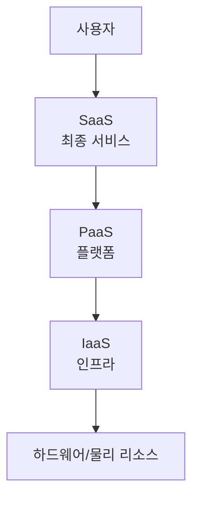

# SaaS, PaaS, IaaS의 차이

## 1. 개념 설명

| 용어   | 전체 이름         | 핵심 개념                                       |
|--------|------------------|------------------------------------------------|
| **IaaS**  | Infrastructure as a Service | 서버, 스토리지, 네트워킹 등 인프라 자원을 인터넷을 통해 빌려쓰는 모델 (하드웨어 가상화, 자원 관리 직접) |
| **PaaS**  | Platform as a Service      | 애플리케이션 개발에 필요한 플랫폼(미들웨어·DB·개발도구 등)을 서비스로 제공, 인프라 관리 부담 감소    |
| **SaaS**  | Software as a Service     | 완성된 소프트웨어(애플리케이션)를 인터넷을 통해 서비스로 제공, 사용자 입장에서는 설치·운영 無        |

## 2. 주요 특징 및 예시

### IaaS (Infrastructure as a Service)
- **특징**: 서버, 스토리지, 네트워크 등 기본 인프라를 서비스로 제공
- **이용자**: 클라우드 위에 직접 인프라/OS/미들웨어/애플리케이션을 직접 설치, 운영하고 싶은 경우
- **예시**: AWS EC2, Microsoft Azure VM, Google Compute Engine

### PaaS (Platform as a Service)
- **특징**: 인프라 + OS + 미들웨어 + 개발 프레임워크를 패키지로 제공
- **이용자**: 개발에 집중하고 인프라 관리(배포, 확장, 모니터링 등)를 최소화하고 싶은 개발자/기업
- **예시**: Heroku, Google App Engine, AWS Elastic Beanstalk

### SaaS (Software as a Service)
- **특징**: 최종 사용자가 바로 사용하는 완성된 소프트웨어를 웹 등에서 구독/이용
- **이용자**: 프로그램을 직접 설치하지 않고, 기능 사용만 필요한 엔드 유저
- **예시**: Gmail, Slack, Salesforce, Google Docs

## 3. 계층적 구조도

- 위로 갈수록 사용자가 관리해야 할 부분이 적어지며, 아래로 갈수록 제어 권한은 많아지나 직접 관리가 늘어남

## 4. 정리
			
|        | IaaS                                    | PaaS                                 | SaaS                      |
|--------|-----------------------------------------|--------------------------------------|---------------------------|
| 관리 대상 | OS, 앱, 미들웨어 등 직접 관리               | 앱(소스코드)만 집중                  | 사용·설정만               |
| 사용자 유연성 | 가장 높음                               | 중간                                 | 가장 낮음                 |
| 예시     | AWS EC2, Naver Cloud, Azure VM        | Heroku, Google App Engine, Beanstalk | Gmail, Zoom, Notion, Slack|

### 참고자료
- [AWS-클라우드 컴퓨팅 모델](https://aws.amazon.com/ko/types-of-cloud-computing/)
- [Microsoft Azure - IaaS(서비스 제공 인프라)란 무엇인가요?](https://azure.microsoft.com/ko-kr/resources/cloud-computing-dictionary/what-is-iaas)
- 
