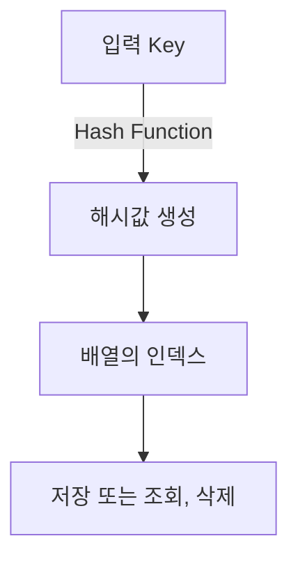

# 해시테이블(Hash Table)의 동작 원리와 장단점

## 1. 해시테이블이란?
- **해시테이블**은 Key-Value 쌍으로 데이터를 저장하는 자료구조입니다.
- Key를 입력받아 해시 함수를 통해 배열의 인덱스로 변환하여 데이터를 저장하거나 탐색합니다.

## 2. 동작 원리
1. **해시 함수(Hash Function)**
    - 입력받은 Key를 정수값(해시값)으로 변환
    - 해시값을 배열 크기로 나눈 나머지를 인덱스로 사용
2. **삽입(Insertion)**
    - Key에 대해 해시 함수를 적용해 위치를 찾고, 해당 인덱스에 Value 저장
3. **탐색(Lookup)**
    - 찾고자 하는 Key에 해시 함수를 적용해 배열에서 Value를 빠르게 조회
4. **삭제(Deletion)**
    - Key의 해시 인덱스를 찾아 Value 삭제

## 3. 해시 충돌(Collision)과 해결 방법
- 서로 다른 Key가 같은 해시값을 가질 때 발생(즉, 같은 배열 인덱스에 매핑)
- **해결 방법**
  - **체이닝(Chaining):** 인덱스마다 연결 리스트 등으로 여러 데이터를 저장
  - **오픈 어드레싱(Open Addressing):** 빈 인덱스를 찾아 저장(예: Linear probing)

## 4. 장점
- **탐색, 삽입, 삭제 연산이 평균적으로 O(1)**
- Key로 Value를 빠르게 찾을 수 있어 캐시, 딕셔너리 등에서 자주 활용

## 5. 단점
- 해시 함수 품질이 낮으면 충돌 증가 → 성능 저하
- 저장 공간이 비효율적일 수 있다(해시 테이블 크기와 요소 수 불균형)
- 데이터의 순서 보장 x

## 6. 실무 활용 예시

1. **데이터베이스 인덱스**
   - MySQL, PostgreSQL 등 관계형 DB에서는 해시 인덱스를 사용해 특정 컬럼의 값을 빠르게 검색할 수 있음.
   - 예: `SELECT * FROM users WHERE email='jin@example.com'`처럼, email 컬럼이 해시 인덱스일 때 빠른 검색이 가능.

2. **컴파일러 심볼 테이블(Symbol Table)**
   - 변수명, 함수명 등 식별자를 Key로 해서 정보(자료형, 메모리 주소 등)를 관리.
   - 해시테이블을 사용하면 변수 참조 및 새로운 선언의 중복 검사 시 성능을 대폭 향상.

3. **캐시(Cache) 시스템**
   - 자주 조회되는 데이터를 Key-Value 구조로 저장하여 DB 접근 없이 빠르게 제공.
   - 웹 서버의 세션 정보, DNS 캐싱 등에서 활용.
   - 예: Redis, Memcached 같은 인메모리 데이터베이스의 내부 구조.

4. **프로그래밍 언어의 딕셔너리/맵 자료형**
   - 파이썬의 `dict`, 자바의 `HashMap`, 자바스크립트의 `Object`(ES6부터는 `Map`) 등이 해시테이블로 구현.
   - 프로그램 내 키워드, 설정 값, 상태 저장 등에 폭넓게 사용.

5. **중복 검사 및 빠른 조회가 필요한 서비스**
   - 실시간 중복 요청 차단(예: 단일 유저의 중복 로그인 방지)
   - 해시셋(hash set) 방식으로 중복 데이터 저장을 방지
   - 대표적 사례: 회원가입 시 이메일 중복 체크, 상품ID 존재 여부 검사 등

6. **분산 시스템의 샤딩/파티셔닝**
   - 서버나 데이터 샤드를 선택할 때, 사용자 ID 등에 해시를 적용해 균등하게 분산
   - 예: 대규모 카카오톡, 페이스북 메시지 서버의 데이터 분산 저장

---

### 참고 자료
- [위키백과: 해시 테이블](https://ko.wikipedia.org/wiki/%ED%95%B4%EC%8B%9C_%ED%85%8C%EC%9D%B4%EB%B8%94)
- [baeldung: Hash Tables in Java](https://www.baeldung.com/java-hashmap)
