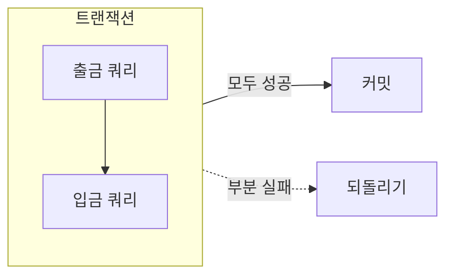

## 트랜잭션(Transaction)이란?
- 데이터베이스에서 하나의 논리적 작업 단위로 수행되는 연산들의 집합  
- 여러 데이터 변경 작업을 하나의 묶음(개별 쿼리의 집합)으로 처리  
- “모두 성공” 또는 “모두 실패”만을 허용하여 데이터의 일관성을 보장함

## ACID 원칙
데이터베이스 트랜잭션이 안전하고 신뢰성 있게 동작하기 위해 반드시 충족해야 하는 4가지 속성

1. **Atomicity (원자성)**  
    - 트랜잭션에 포함된 연산이 모두 성공하거나, 모두 실패해야 한다  
    - 부분적으로만 실행되는 경우는 허용하지 않음

2. **Consistency (일관성)**  
    - 트랜잭션 처리 전과 후에 데이터베이스의 일관성이 유지되어야 한다  
    - 모든 제약 조건과 규칙을 항상 만족해야 함

3. **Isolation (고립성)**  
    - 동시에 여러 트랜잭션이 수행되어도 각각의 트랜잭션은 독립적으로 실행된다  
    - 중간 연산 결과가 다른 트랜잭션에 노출되지 않음

4. **Durability (지속성)**  
    - 트랜잭션이 성공적으로 커밋된 후에는 시스템에 장애가 발생해도 결과가 영구적으로 저장된다

## 예시
은행 이체
- A계좌에서 1만 원 출금 → B계좌에 1만 원 입금
- 한 과정이라도 실패하면 전체가 취소되어야 함 (데이터 불일치 방지)

## 그림으로 이해하기

## 참고 자료
- [트랜잭션과 ACID 원칙 (위키백과)](https://ko.wikipedia.org/wiki/트랜잭션_처리)
- [모던 데이터베이스 실무: 트랜잭션이란? (velog)](https://velog.io/@kscode/Transaction-ACID)
