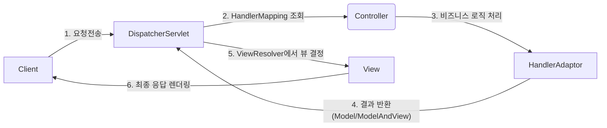

# 스프링 MVC DispatcherServlet 흐름

## 1. DispatcherServlet이란?
- 스프링 MVC에서 모든 HTTP 요청의 진입 지점(Front Controller) 역할을 하는 서블릿(Servlet)
- 요청을 받아서 컨트롤러에 전달하고, 결과를 받아 뷰에 반환하는 "요청 처리 중심 허브"

## 2. 전체 동작 흐름



## 3. 단계별 주요 설명

1. **클라이언트 요청**: 사용자가 웹 브라우저 등에서 요청을 보냄
2. **DispatcherServlet 진입**: 스프링 부트에서는 `@SpringBootApplication` 기반으로 자동 등록됨
3. **HandlerMapping**: 어떤 Controller(핸들러)가 요청을 처리할지 조회 (예: URL 매핑)
4. **HandlerAdapter**: 찾은 핸들러(컨트롤러)를 실제로 실행하는 중간 어댑터
5. **컨트롤러 처리**: 비즈니스 로직 수행, 결과 데이터를 반환 (Model/ModelAndView 등)
6. **ViewResolver**: 반환 결과(View 이름)에 따라, 실제 렌더링 뷰(HTML, JSP, JSON 등) 결정
7. **뷰 렌더링 및 응답**: View가 클라이언트에 최종 응답

## 4. 코드 예시(기본 구조)

```java
@Controller
public class HelloController {
    @GetMapping("/hello")
    public String hello(Model model) {
        model.addAttribute("data", "jin");
        return "hello"; // 뷰 이름
    }
}
```

## 5. 정리(특징 요약)
- DispatcherServlet이 “모든 요청 처리 흐름”의 중심에 있다(Front Controller 패턴)
- HandlerMapping, HandlerAdapter, ViewResolver 등 확장/변경이 매우 용이함
- 커스텀 필터, 인터셉터, 예외처리, 로깅 등 다양한 기능을 쉽게 추가 가능

---

### 참고 자료
- [공식 문서: DispatcherServlet](https://docs.spring.io/spring-framework/docs/current/reference/html/web.html#mvc-servlet)
- [위키독스: DispatcherServlet 동작 흐름](https://wikidocs.net/8108)
